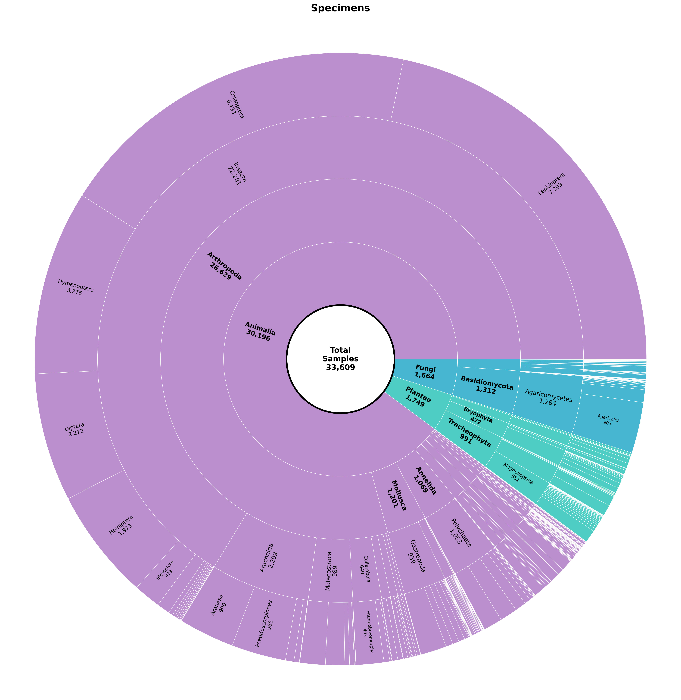

# Sunburst Chart Generator

A powerful Python script that creates hierarchical sunburst charts from CSV data, supporting up to 5 levels of hierarchy with excellent color discrimination and professional formatting.



## Features

### 🌟 **Core Capabilities**
- **Multi-level Hierarchy**: Support for 3-5 hierarchical levels
- **Dynamic Structure**: Automatically adapts ring widths based on number of levels
- **Smart Color Coding**: Distinct colors for maximum discrimination between segments
- **Guaranteed Labeling**: All level 2 segments always get labels
- **Perfect Text Orientation**: Labels always radiate outward (never upside down)
- **Multiple Output Formats**: PNG, PDF, SVG, EPS, JPG, TIFF

### 🎨 **Visual Excellence**
- **Hierarchical Color Inheritance**: Two modes for simplified color palettes
- **Color Variations**: Create progressive color shades through hierarchy levels
- **Same Color Mode**: Use identical colors across inheritance levels
- **Black Text**: All text is rendered in black for maximum readability
- **Smart Font Sizing**: Adaptive font sizes based on segment size and level
- **Clean Borders**: White borders for clear segment separation
- **Professional Layout**: Optimized spacing and proportions
- **Scalable Output**: Vector formats (SVG, PDF, EPS) for infinite scalability

### 📊 **Data Handling**
- **Automatic Sorting**: Segments ordered by size (largest first)
- **Missing Data Handling**: Robust handling of incomplete records
- **Large Dataset Support**: Efficiently processes thousands of records
- **Flexible Column Mapping**: Customizable column names for any CSV structure
- **Dual Counting Modes**: Count all records or unique values in specified column

## Installation

### Prerequisites
```bash
pip install pandas matplotlib numpy
```

### Download
Save the script as `sunburst_chart_script.py` in your working directory.

## Quick Start

### Basic Usage
```bash
python sunburst_chart_script.py your_data.csv
```

This creates a sunburst chart with:
- **Level 1**: `Partner_sub` column
- **Level 2**: `partner` column  
- **Level 3**: `Project-Code` column
- **Output**: `sunburst_chart.png` (plus auto-generated SVG and PDF versions)

### Custom Column Names
```bash
python sunburst_chart_script.py data.csv \
  --level1 "Category" \
  --level2 "Subcategory" \
  --level3 "Item"
```

### Count Unique Values
```bash
# Count all records (default behavior)
python sunburst_chart_script.py data.csv

# Count unique values in Sample-ID column
python sunburst_chart_script.py data.csv --count-unique

# Count unique species (useful for biodiversity analysis)
python sunburst_chart_script.py data.csv --sample-id "Species" --count-unique
```

### Color Inheritance
```bash
# Default: Level 1 inheritance with color variations (progressive shading)
python sunburst_chart_script.py data.csv --color-inherit-level 1 --color-mode variations

# Level 1 inheritance with same colors (no shading)
python sunburst_chart_script.py data.csv --color-inherit-level 1 --color-mode same

# Level 2 inheritance: Levels 1-2 get unique colors, level 3+ inherit from level 2
python sunburst_chart_script.py data.csv --color-inherit-level 2 --color-mode variations

# Level 3 inheritance with same colors throughout deeper levels
python sunburst_chart_script.py data.csv --color-inherit-level 3 --color-mode same
```
```bash
# 4 levels
python sunburst_chart_script.py data.csv --level4 "SubItem"

# 5 levels  
python sunburst_chart_script.py data.csv \
  --level4 "SubItem" \
  --level5 "DetailLevel"
```

## Command Line Options

| Option | Default | Description |
|--------|---------|-------------|
| `csv_file` | - | **Required**: Path to input CSV file |
| `--sample-id` | `Sample-ID` | Column name for counting samples |
| `--count-unique` | `False` | Count unique values in sample-id column instead of all records |
| `--level1` | `Partner_sub` | First hierarchy level (innermost ring) |
| `--level2` | `partner` | Second hierarchy level |
| `--level3` | `Project-Code` | Third hierarchy level |
| `--level4` | `None` | Fourth hierarchy level (optional) |
| `--level5` | `None` | Fifth hierarchy level (optional) |
| `--color-inherit-level` | `1` | Level from which colors are inherited (1-5) |
| `--color-mode` | `variations` | Color inheritance mode: `variations` or `same` |
| `--output` | `sunburst_chart.png` | Output filename with extension |
| `--title` | `Data Sunburst Analysis` | Chart title |
| `--width` | `18` | Figure width in inches |
| `--height` | `18` | Figure height in inches |
| `--no-auto-formats` | `False` | Skip automatic SVG/PDF generation |

## Output Formats

### Supported Formats
- **PNG**: High-quality raster (default)
- **SVG**: Vector format for Illustrator/Inkscape
- **PDF**: Vector format for documents/printing
- **EPS**: Vector format for scientific publications
- **JPG/JPEG**: Compressed raster format
- **TIFF**: High-quality raster for print

### Format Examples
```bash
# SVG for editing in Illustrator
python sunburst_chart_script.py data.csv --output chart.svg

# PDF for LaTeX documents
python sunburst_chart_script.py data.csv --output chart.pdf

# High-resolution PNG only
python sunburst_chart_script.py data.csv --output chart.png --no-auto-formats
```

### Automatic Format Generation
By default, the script creates additional formats for convenience:
- **SVG version**: For vector editing
- **PDF version**: For high-quality printing

Disable with `--no-auto-formats` if you only want the specified format.

## CSV Data Requirements

### Required Structure
Your CSV must contain:
1. **Sample ID column**: For counting (default: `Sample-ID`)
2. **Hierarchy columns**: 3-5 columns defining the hierarchy levels
3. **No missing values**: In the hierarchy columns for records to be included

### Example CSV Structure
```csv
Sample-ID,Partner_sub,partner,Project-Code,Category,Subcategory
BGE_001,partner,CIBIO,BBIOP,Insects,Beetles
BGE_002,partner,CIBIO,BBIOP,Insects,Moths
BGE_003,subcontractor,ALPFU,ALPFU,Plants,Ferns
BGE_004,partner,NHMUK,BNHMUK,Marine,Fish
```

### Data Processing
- **Automatic Cleaning**: Removes rows with missing hierarchy data
- **String Normalization**: Trims whitespace from all values
- **Size-based Sorting**: Orders segments by count within each level
- **Hierarchical Validation**: Ensures proper parent-child relationships

## Examples

### Basic 3-Level Chart
```bash
python sunburst_chart_script.py museum_data.csv \
  --level1 "Institution_Type" \
  --level2 "Institution_Name" \
  --level3 "Collection_Type" \
  --title "Museum Collections Analysis"
```

### Species Diversity Analysis
```bash
python sunburst_chart_script.py biodiversity_data.csv \
  --level1 "Kingdom" \
  --level2 "Phylum" \
  --level3 "Class" \
  --sample-id "Species" \
  --count-unique \
  --title "Species Diversity by Taxonomy"
```

### Extended 5-Level Analysis
```bash
python sunburst_chart_script.py biodiversity_data.csv \
  --level1 "Kingdom" \
  --level2 "Phylum" \
  --level3 "Class" \
  --level4 "Order" \
  --level5 "Family" \
  --output "biodiversity_sunburst.svg" \
  --title "Biodiversity Distribution"
```

### Simplified Color Palette
```bash
# Color variations: Progressive shading through hierarchy levels
python sunburst_chart_script.py biodiversity_data.csv \
  --color-inherit-level 1 \
  --color-mode variations \
  --title "Progressive Color Shading"

# Same colors: Identical colors for all inherited levels
python sunburst_chart_script.py biodiversity_data.csv \
  --color-inherit-level 1 \
  --color-mode same \
  --title "Uniform Color Scheme"

# Two-level inheritance with variations
python sunburst_chart_script.py biodiversity_data.csv \
  --color-inherit-level 2 \
  --color-mode variations \
  --title "Two-Level Color Variations"
```

### Large Format for Printing
```bash
python sunburst_chart_script.py data.csv \
  --width 24 \
  --height 24 \
  --output "poster_chart.pdf"
```

## Output Description

### Files Generated
When you run the script, you typically get:
1. **Main output**: Your specified format (e.g., `chart.png`)
2. **SVG version**: `chart.svg` (for editing)
3. **PDF version**: `chart.pdf` (for printing)

### Chart Structure
- **Center Circle**: Total sample count
- **Ring 1**: First hierarchy level (e.g., partner types)
- **Ring 2**: Second hierarchy level (e.g., individual partners)
- **Ring 3+**: Additional hierarchy levels
- **Legend**: Shows level 1 categories with counts

### Visual Elements
- **Proportional Segments**: Size reflects actual data counts
- **Hierarchical Color Scheme**: Two inheritance modes for optimal visual organization
- **Black Text Labels**: All segments labeled with name and count in crisp black text
- **Professional Typography**: Optimized fonts and sizing
- **Clean Borders**: White borders separate all segments

## Counting Modes

The script supports two counting modes that determine how data is aggregated in each segment:

### Record Counting (Default: `--count-unique` not specified)
- **Behavior**: Counts every row/record in the dataset
- **Use Case**: Shows sampling effort, total specimens, or processing volume
- **Example**: If you have 5 specimens of the same species, it counts as 5

### Unique Value Counting (`--count-unique`)
- **Behavior**: Counts unique values in the specified `--sample-id` column
- **Use Case**: Shows diversity, distinct items, or unique occurrences
- **Example**: If you have 5 specimens of the same species, it counts as 1

### Practical Examples

#### Biodiversity Analysis
```bash
# Count total specimens per family
python sunburst_chart_script.py biodiversity.csv \
  --level1 "Class" --level2 "Order" --level3 "Family"

# Count unique species per family  
python sunburst_chart_script.py biodiversity.csv \
  --level1 "Class" --level2 "Order" --level3 "Family" \
  --sample-id "Species" --count-unique
```

#### Sample Processing Analysis
```bash
# Count total processing attempts
python sunburst_chart_script.py lab_data.csv

# Count unique samples processed
python sunburst_chart_script.py lab_data.csv --count-unique
```

### When to Use Each Mode

| Analysis Goal | Counting Mode | Why |
|---------------|---------------|-----|
| **Sampling effort** | Record counting | Shows total work/specimens collected |
| **Species diversity** | Unique counting with `--sample-id "Species"` | Shows biodiversity richness |
| **Geographic coverage** | Unique counting with `--sample-id "Location"` | Shows distinct locations sampled |
| **Processing volume** | Record counting | Shows total laboratory throughput |
| **Sample coverage** | Unique counting | Shows distinct samples processed |

## Color Inheritance System

The script supports a sophisticated hierarchical color inheritance system with two distinct modes:

### Color Inheritance Levels
- **Level 1 Inheritance**: Each top-level category gets a unique color, all descendants inherit from their ancestor
- **Level 2 Inheritance**: Both level 1 and level 2 categories get unique colors, level 3+ inherit from their level 2 parent
- **Level N Inheritance**: Levels 1 through N get unique colors, deeper levels inherit from their level N ancestor

### Color Modes

#### **Variations Mode** (`--color-mode variations`, default)
Creates progressive color shading through hierarchy levels:
- **Level 1**: Green, Yellow (base colors)
- **Level 2**: Light Green, Dark Green, Light Yellow, Dark Yellow (variations of parent)
- **Level 3**: Very Light Green, Medium Green, etc. (variations of level 2 parent)

#### **Same Mode** (`--color-mode same`)
Uses identical colors across inheritance levels:
- **Level 1**: Green, Yellow (base colors)
- **Level 2**: Green, Yellow (exact same colors)
- **Level 3**: Green, Yellow (exact same colors)

### Benefits
- **Simplified Palette**: Reduces color complexity while maintaining visual hierarchy
- **Better Grouping**: Related items share color families (variations mode) or identical colors (same mode)
- **Improved Readability**: Fewer distinct base colors make charts easier to interpret
- **Flexible Control**: Choose inheritance level and color mode that works best for your data
- **Progressive Shading**: Variations mode creates natural visual depth
- **Uniform Appearance**: Same mode creates clean, consistent visual groupings

### Examples
```bash
# Traditional approach (many distinct colors at each level)
python sunburst_chart_script.py data.csv --color-inherit-level 5

# Progressive shading (default)
python sunburst_chart_script.py data.csv --color-inherit-level 1 --color-mode variations

# Uniform color families
python sunburst_chart_script.py data.csv --color-inherit-level 1 --color-mode same

# Two-level hierarchy with shading
python sunburst_chart_script.py data.csv --color-inherit-level 2 --color-mode variations
```

## Performance Notes

### Dataset Size
- **Small datasets** (< 1,000 records): Instant processing
- **Medium datasets** (1,000-10,000): 1-5 seconds
- **Large datasets** (10,000+): 5-30 seconds

### Memory Usage
- Approximately 1MB RAM per 10,000 records
- Vector formats (SVG/PDF) use minimal additional memory
- High-resolution raster formats may require more memory

### Optimization Tips
- Remove unnecessary columns before processing
- Use `--no-auto-formats` if you only need one format
- For very large datasets, consider sampling or aggregation

## Troubleshooting

### Common Issues

#### "Column not found" Error
```
ValueError: Column 'Partner_sub' not found in CSV
```
**Solution**: Check your column names and use the correct `--level1`, `--level2`, etc. options.

#### Empty Chart or Missing Segments
**Cause**: Missing data in hierarchy columns  
**Solution**: Clean your data to ensure all required columns have values.

#### Text Overlap
**Cause**: Too many small segments  
**Solution**: Aggregate smaller categories or increase figure size with `--width` and `--height`.

#### Poor Color Distinction
**Cause**: Too many categories at one level  
**Solution**: Consider grouping smaller categories or using fewer hierarchy levels.

### Data Quality Checks
The script automatically reports:
- Total rows loaded
- Rows after cleaning (removing missing data)
- Number of categories at each level
- Size distribution statistics

### Debug Mode
For troubleshooting, the script prints detailed information:
```
Loaded 34905 rows from bge_museum_data.csv
After removing rows with missing data: 34905 rows
Active hierarchy levels: 3 - ['Partner_sub', 'partner', 'Project-Code']
Creating 3 level sunburst with radii: [0.15, 0.38333333333333336, 0.6166666666666667, 0.85]
```

## License

This script is provided as-is for research and educational purposes. Feel free to modify and distribute.

## Contributing

To improve this script:
1. Fork or copy the script
2. Make your improvements
3. Test with various datasets
4. Share your enhancements

## Citation

If you use this script in research or publications, please cite:
```
Sunburst Chart Generator. (2024). Python script for hierarchical data visualization.
```

---

**Need help?** Check the examples above or run `python sunburst_chart_script.py --help` for detailed options.
